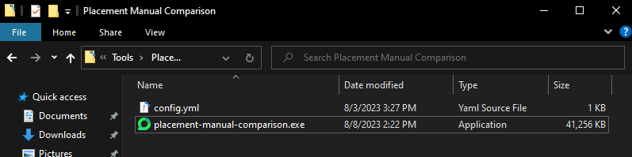
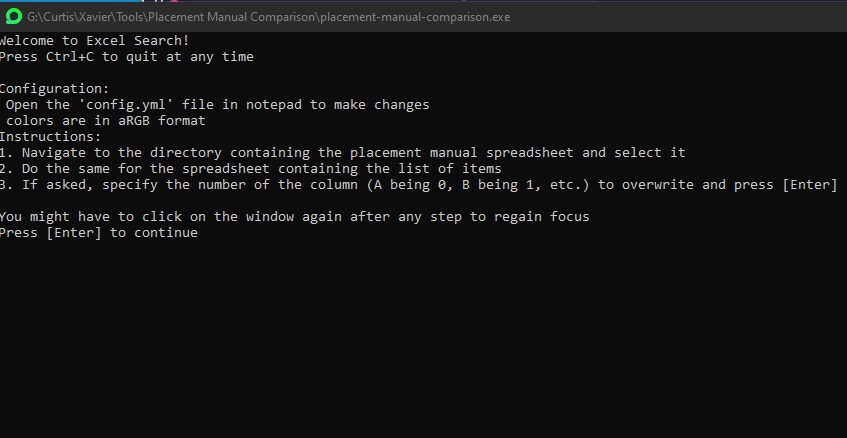
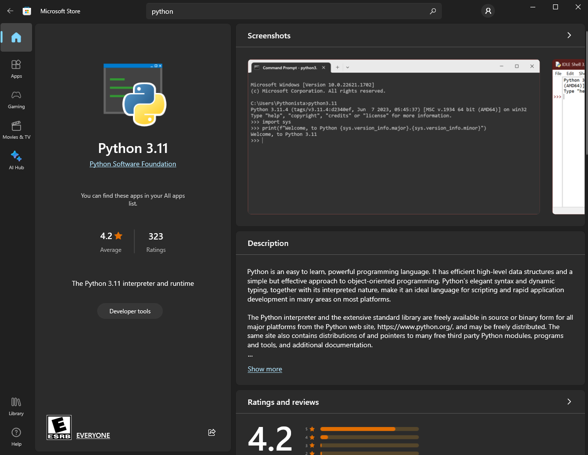
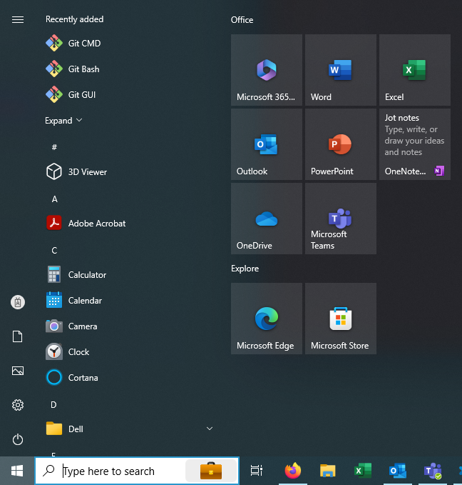
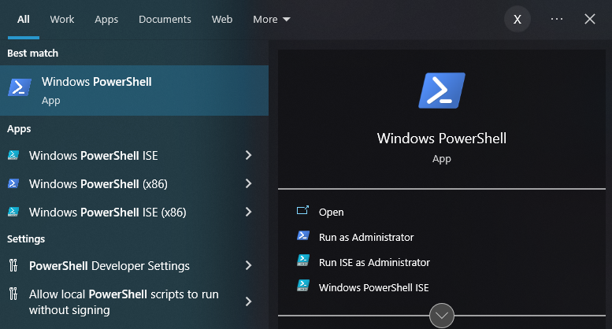
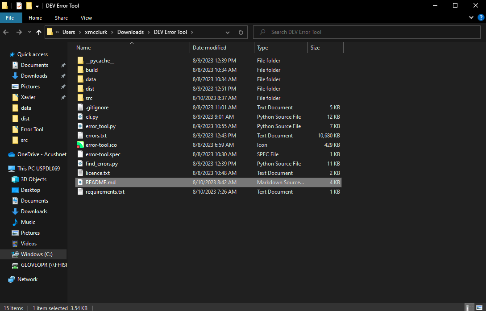
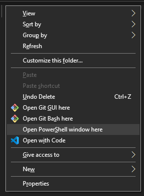

  

#  Placement Manual Comparison

**Placement Manual Comparison Tool** is a tool built to 

## Usage
Using the program is should be pretty simple. It's bundled as a standalone `.exe` file that you can put anywhere on your computer.

### 1. Find the Exe
It should be stored somewhere on your computer. You can find it in your file explorer app, or keep it on your desktop. It looks like this.

The file name is . Depending on your settings, the `.exe` part might not show at the end of the file name, but it's there.

### 2. Run the Exe
Just double click it, easy. You can also right click on it and press **Open**. A command prompt window  should show up. Give it a second to load.

### 3. Start the Program
You should see a window that looks kinda like this:

<u>Click on the bar at the top of the window</u> to refocus it *not* the text in the window. With the window selected, press **Enter**.

### 4. Choose  Spreadsheets
In the file picker that appears, choose the Placement Manual and press the confirm button in the bottom right. In the next file picker, choose the  Excel Spreadsheet containing the Catalogue List. Once you have selected both spreadsheets, input the letter of the column to **overwrite** and press **Enter**. If left blank, the value noted as default will be used.

 Note&nbsp; Only excel spreadsheets and folders will show in the file picker. This *should* happen.

Warning&nbsp; The **Catalogue List** should be an excel spreadsheet in which the first column is filled with the skews for each item in the catalogue. Data that shouldn't be there can mess things up.

### 5. Results
Give it a while to run, it's doing its thing. When prompted, press **Enter**. In the next prompt type **y** or **n** and hit **Enter** one last time. The rows filled in with  color were in the catalogue you just input.

 Note&nbsp; If the option is set in the configuration file, this *overwrites* the column, so if you ran the program twice in the same column by accident, only the last one you ran shows.

 🎉 Congratulations! 🎊🥳 You read the important part of the documentation. The rest is just in case something goes wrong. If it worked, stop here my dude. 

## Errors :(
This section addresses some possible **problems** that could occur when running the program.

### 

### Unexpected Crash
If the program fails to run as expected or <u>closes before it has completed</u>, something probably went wrong on the code side of things. To fix this, the first step would be to figure out exactly what went wrong. 

Open the folder containing the exe in your file explorer app, then hold **Shift** and *right click*  on the empty space in the folder. Click Open PowerShell window here in the menu that pops up.

In the powershell window, type `./placement-manual-comparison.exe` and press **ENTER**. Interact with the program how you would normally from here. If the program doesn't crash this time then it was probably just a fluke the first time. If it does crash, this window will show an error message that you can google.

### Deleted/Can't Find EXE 😳
If you've lost the exe file, don't worry! 😎 There's a long and convoluted process to getting it back (See [Installation](#installation)).

### Anything Else
If the error fits none of these or nothing else worked, try [Rebuilding the Executable](#installation) under the **Installation** section. Only do this as a last resort, 'cause it take mad long if you aren't used to it and it's easy to mess up. If even *that* doesn't work, honestly idk 💀.

## Installation
If you already have the exe file **ignore this**, but if it got deleted, you can't find it or it was otherwise malformed, follow these steps to rebuild the project.

### 1. Install Python
Python can be found in the Microsoft Store. The version used in this project is 3.11 so for the best results, look for that. Just click the big shiny **Get** button.

### 2. Install pip
Open a command prompt window (preferably powershell) by pressing the windows key  on your keyboard to open the start menu. In the search bar that pops up, enter "`powershell`" and click Open.

  
  

&nbsp;

You should now see a window that looks like this:

In the window type in `python get-pip.py` and press **Enter**. This will install pip on your computer, which you can use to install dependencies.

### 3. Install dependencies
Read the **Dependencies** section for the actual packages to install. To install a package, type `pip install <package-name>` into powershell and then press enter. For example, to install `openpyxl` you would type `pip install openpyxl` (not `pip install <openpyxl>` 👎). Do this for every package listed under **Dependencies**. If you get an error later in the process saying that packages could not be found, simply search for the name of the package in the error message and install them this way

### 4. Locate the code
Open your Files app and find the folder with the code for this program. If you downloaded it, it's probably in your ✨**Downloads Folder** .✨ If you didn't you can do that by going to [github](https://github.com/xavmcc3/error-tool) and clicking the the install as zip button. (Just google "`how to download github repo as zip`") Once it downloads, extract it anywhere. The folder structure should look something like this:

Just make sure you have `find_errors`, `cli`, and `find_errors` in the folder. Once you have found the folder, open it in powershell. The easiest way to do this is to hold **Shift** and right click  on the empty space in the folder, then click Open PowerShell window here in the menu that pops up.

In the prompt that appears type *exactly* `python -m PyInstaller --clean error-tool.spec` and press enter. Let it run for a while. When the prompt comes back up with absolutely no errors please god aaaaaaaa, go back to your File Explorer and open the dist folder. There should be a shiny new ✨~executable file~ 🌟✨ . Just copy it anywhere (even put it on your desktop if you're feelin it) and double click it to run. 👍

## Dependencies
The standalone exe has no dependencies, but it should be in a folder with a file called `errors.txt`. If it isn't it will create one when run.

The python code requires the following packages, but if you're just running the exe don't worry about it.
 - [ ] windows-curses
 - [ ] openpyxl
 - [ ] pyinstaller
 - [ ] clrprint

## Liscence `MIT`

Copyright 2023 Xavier McClurkin

Permission is hereby granted, free of charge, to any person obtaining a copy of this software and associated documentation files (the “Software”), to deal in the Software without restriction, including without limitation the rights to use, copy, modify, merge, publish, distribute, sublicense, and/or sell copies of the Software, and to permit persons to whom the Software is furnished to do so, subject to the following conditions:

The above copyright notice and this permission notice shall be included in all copies or substantial portions of the Software.

THE SOFTWARE IS PROVIDED “AS IS”, WITHOUT WARRANTY OF ANY KIND, EXPRESS OR IMPLIED, INCLUDING BUT NOT LIMITED TO THE WARRANTIES OF MERCHANTABILITY, FITNESS FOR A PARTICULAR PURPOSE AND NONINFRINGEMENT. IN NO EVENT SHALL THE AUTHORS OR COPYRIGHT HOLDERS BE LIABLE FOR ANY CLAIM, DAMAGES OR OTHER LIABILITY, WHETHER IN AN ACTION OF CONTRACT, TORT OR OTHERWISE, ARISING FROM, OUT OF OR IN CONNECTION WITH THE SOFTWARE OR THE USE OR OTHER DEALINGS IN THE SOFTWARE.
 
