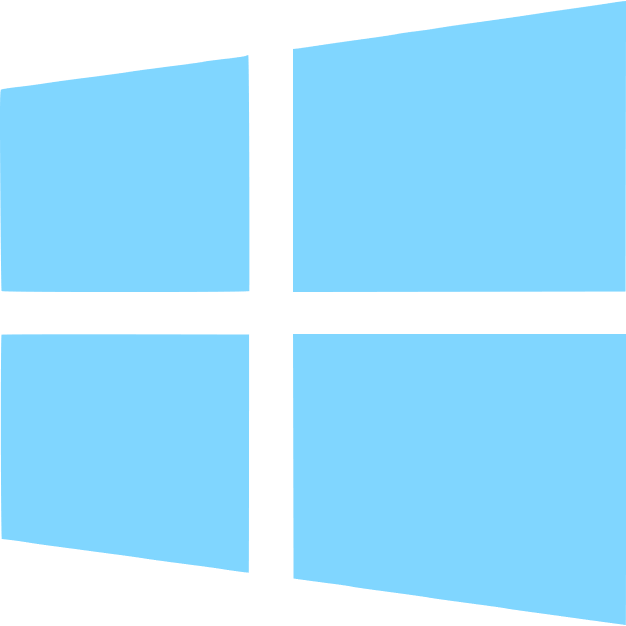

<p align="center">
  
</p>

#  Placement Manual Comparison

<span style=" display: inline-block; background: #00ebf3; width: 0.7em; height: 1.1em; margin-bottom: -4px; border-radius: 5px; box-shadow: 0 0 0.9em #00ebf3be;"></span> **Placement Manual Comparison Tool** is a tool built to highlight any cells in a specified row in the placement manual that are in a given season catalog. This can be done multiple times with different catalogs in different columns to determine which items can be removed from the placement manual.


## Usage
Using the program should be pretty simple. It's bundled as a standalone <span style=" display: inline-block; background: #00ebf3; padding: 0 6px; margin-bottom: -3px; border-radius: 5px; box-shadow: 0 0 0.9em #00ebf3be; color: #000000;">**.exe**</span> file that you can put anywhere on your computer, though it needs to be in the same folder as a file called <span style=" display: inline-block; background: #f300d3; padding: 0 6px; margin-bottom: -3px; border-radius: 5px; box-shadow: 0 0 0.9em #f300dfbe; color: #000000;">**config.yml**</span>.

<span style="box-shadow: 0 0 0.9em #ff91009c; padding: 1px 5px; border-radius: 5px; border: 1px solid #ff910098; color: #ff9100;"> Warning</span>&nbsp; This program <span style="color: #ff9100;">**Overwrites**</span> columns in the placement manual. Make sure you have a backup in case you input the wrong column by accident, 🤯 and make sure you run it on a blank column (or one that you *want*
 gone).

### 1. Find the Exe
It should be stored somewhere on your computer. You can find it in your file explorer app , or keep it on your desktop. It looks like this.

The file name is **placement-manual-comparison<span style="display: inline-block; background: #00ebf3; padding: 0 6px; margin-bottom: -3px; border-radius: 5px; box-shadow: 0 0 0.9em #00ebf3be; color: #000000;">.exe</span>**. Depending on your settings, the `.exe` part might not show at the end of the file name, but it's there.

### 2. Run the <span style="background: #d400ff; box-shadow: 0 0 0.9em #ff00ff; border-radius: 5px; padding: 0 5px; color: #000000;">Exe</span>
Just double-click it, easy. You can also right click on it and press <span style="rotate: -10deg; display: inline-block;">**Open**</span>. A command prompt window  should show up. Give it a second to load.

### 3. Start the Program
You should see a window that looks kinda like this:

<u>Click on the bar at the top of the window</u> to refocus it *not* the text in the window. With the window selected, press <span style="background: transparent; padding: 1px 5px; color: #95b1ff; border: 1px solid #95b1ff; border-radius: 5px; box-shadow: 0 0 0.9em #95b1ffbe;">**Enter**</span>.

### 4. Choose  Spreadsheets
In the file picker that appears, choose the <span style=" color: #4ae445;">Placement Manual</span> and press the confirm button in the bottom right. In the next file picker, choose the  Excel Spreadsheet containing the <span style="color: #4ae445;">Catalogue List</span>. Once you have selected both spreadsheets, input the letter of the column to <span style=" color: #ecd031;">**overwrite**</span> and press <span style=" background: transparent; padding: 1px 5px; color: #95b1ff; border: 1px solid #95b1ff; border-radius: 5px; box-shadow: 0 0 0.9em #95b1ffbe;">**Enter**</span>. If left blank, the value noted as default value (<span style=" display: inline-block; scale: 1.1; transform: rotate3d(1, 0, 1, 45deg);">N</span>) will be used.

<span style="display: block; opacity: 0.5;">Placement manual</span>

<span style="display: block; opacity: 0.5;">Catalogue list</span>

<span style="box-shadow: 0 0 0.9em #ffffff5d; padding: 1px 5px; border-radius: 5px; border: 1px solid #ffffff98; "> Note</span>&nbsp; Only excel spreadsheets and folders will show in the file picker. This is to prevent anyone whose common sense is temporarily malfunctioning from picking things that aren't spreadsheets and folders.

<span style="box-shadow: 0 0 0.9em #ffee009c; padding: 1px 5px; border-radius: 5px; border: 1px solid #ffd00098; color: #ffd000;">Warning</span>&nbsp; The <span style=" color: #ecd031;">**Catalogue List**</span> should be an excel spreadsheet in which the first column is filled with the skews for each item in the catalog. Data that shouldn't be there can mess things up.


### 5. Results
Give it a while to run, it's doing its thing. When prompted, press <span style="background: transparent; padding: 1px 5px; color: #95b1ff; border: 1px solid #95b1ff; border-radius: 5px; box-shadow: 0 0 0.9em #95b1ffbe;">**Enter**</span>. In the next prompt type <span style="background: #40ff40; color: #000000; padding: 0px 5px;  border-radius: 5px; box-shadow: 0 0 0.9em #24ff1ccb;">**y**</span> (to open the spreadsheet) or <span style="background: #f14646; color: #000000; padding: 0px 5px;  border-radius: 5px; box-shadow: 0 0 0.9em #ff0000cb;">**n**</span> (to not) and hit <span style="background: transparent; padding: 1px 5px; color: #ba95ff; border: 1px solid #ba95ff; border-radius: 5px; box-shadow: 0 0 0.9em #ba95ffbe;">**Enter**</span> one last time. Any rows in the selected column filled in with  color were in the catalog you just input.

<span style="display: block; opacity: 0.5;">Results</span>

Now you can run it <span style="filter: drop-shadow(0 0 0.2em #42ff29ff); color: #a6ff00;">**again**</span> on the *other* catalogue lists. Make sure to select a different column each time.

<span style="box-shadow: 0 0 0.9em #ffffff5d; padding: 1px 5px; border-radius: 5px; border: 1px solid #ffffff98;"> Note</span>&nbsp; If the option is set in the configuration file, this *overwrites* the column, so if you ran the program twice in the same column by accident, only the last one you ran shows.

## Configuration
In the same folder as the <span style="display: inline-block; background: #00ebf3; padding: 0 6px; margin-bottom: -3px; border-radius: 5px; box-shadow: 0 0 0.9em #00ebf3be; color: #000000;">**exe**</span>, there should be a file named <span style="display: inline-block; background: #f300d3; padding: 0 6px; margin-bottom: -3px; border-radius: 5px; box-shadow: 0 0 0.9em #f300dfbe; color: #000000;">**config.yml**</span> <span style="opacity: 0.7;">(if not see [**Errors**](#configuration-errors), 'cause the program won't run)</span>. You can edit this to more easily change certain things about how the program works. The alternative is editing the code and rebuilding the executable *every time* for a small change. Open the file in  <span style="color: #74ccff;">**Notepad**</span> <span style="opacity: 0.7;">(or another text editor)</span>. It should look like this, but possibly with some different values.


Below is a list of the properties and what you can change them to. Anything on a line after a `#` is a *comment*, and will be ignored by the program. You can delete anything after a `#` (only on the same line) and the program will run fine.

### `suppress_python_warnings`
Don't worry about this one. It should be `yes`.

### `write_to_text_file`
This decides whether or not to write all the shared values into a text file. Accepted values are `yes` or `no`.

### `overwrite_original`
This one is potentially dangerous. It decides whether or not to write directly into the spreadsheet or to make a copy. Accepted values are `yes` or `no`. If <span style=" display: inline-block; background: #f35900; padding: 0 6px; margin-bottom: -3px; border-radius: 5px; box-shadow: 0 0 0.9em #f37500be; color: #000000;">**no**</span>, the copy will be found in the same folder as the <span style=" display: inline-block; background: #00ebf3; padding: 0 6px; margin-bottom: -3px; border-radius: 5px; box-shadow: 0 0 0.9em #00ebf3be; color: #000000;">**exe**</span>. I recommend keeping this as `yes` because otherwise, you will only ever get one labeled column in a sheet.

### `included_color`
This decides the color of the cells marked in the spreadsheet. It uses aRGB Hex format with no `#` beforehand. This means that to choose a color, you would go to this [Hex Color Picker](https://htmlcolorcodes.com/color-picker/), choose a color, and copy the value labeled **HEX**. An example value would be `#ff5733`. Replace the `#` with two zeroes. In the config file, the line should look like this ` included_color: 00ff5733` <span style=" opacity: 0.7;">(replacing `00ff5733` with your color)</span>.

### `ask_target_column`
This decides whether or not to ask the user what column they want the colors to appear in. This should stay `yes` so that you can have different catalog lists go to different columns. Accepted values are `yes` or `no`.

### `open_when_done`
This decides whether or not to open the spreadsheet after the program is done running. Accepted values are `ask`, `yes`, and `no`. If `ask`, the program will prompt you to enter `y` or `n` to open the file.

### `target_column`
Decides what the *default* column the program will overwrite is. Any non-negative integer is an accepted value. Instead of letters, the columns here are identified with numbers starting at `0` for `A`, `1` for `B`, and so on. Don't worry if that doesn't make sense, just make sure `ask_target_column` is `yes` and it'll have you put in a letter when you run the program. 

<div style=" background: #20212b; color: #eeeeee;padding: 10px 5px 10px 10px; font-family: Calibri; font-size: 0.96em; border-radius: 5px;"> 🎉 Congratulations! 🎊🥳 You read the important part of the documentation. The rest is just in case something goes wrong. If it worked, stop here my dude. </div>


## <span style="display: inline-block; background: #f30035; padding: 0 6px; margin-bottom: -3px; border-radius: 5px; box-shadow: 0 0 0.9em #ff1111be; color: #000000;">**Errors**</span> :(
This section addresses some possible <span style=" color: #f85961;">**problems**</span> that could occur when running the program.

### Unexpected Crash
If the program fails to run as expected or <u>closes before it has completed</u>, something probably went wrong on the code side of things. To fix this, the first step would be to figure out exactly what went wrong.

<span style="box-shadow: 0 0 0.9em #ffffff5d; padding: 1px 5px; border-radius: 5px; border: 1px solid #ffffff98;"> Note</span>&nbsp;  If you accidentally hit <span style=" color: #ff5b5b;">**cancel**</span> in the file picker the program closes, you can just re-run it. If you didn't, keep reading.

Open the folder containing the exe in your file explorer app, then hold <span style=" background: transparent; padding: 1px 5px; color: #34f3b3; border: 1px solid #34f3b3; border-radius: 5px; box-shadow: 0 0 0.9em #34f3b3be;">**Shift**</span> and *right click*  on the space in the folder. Click <span style="color: #ffffff; padding: 0 5px; border-radius: 2px; background: #414141; border: 1px solid white;">Open Power<span style="text-decoration: underline;">S</span>hell window here</span> in the menu that pops up.


In the powershell window, type `./placement-manual-comparison.exe` and press <span style="background: #000000; color: #ffffff;padding: 0 5px; border-radius: 3px; border: 1px solid #ffffff;">**ENTER**</span>. Interact with the program how you would normally from here <span style=" opacity: 0.7;">(No fancy colors tho ☹)</span>. If the program doesn't crash this time then it was probably just a fluke the first time. If it does crash, this window will show an error message that you can google.


<span style=" display: inline-block; padding: 0 5px; border-radius: 5px; color: #ff00ff; border: 2px solid;  box-shadow: 0 0 0.9em #ff00ffd5;">**IMPORTANT**</span> If the error says something about a `missing configuration file` or `config.yml`, see the [Configuration Errors](#configuration-errors) Section

### Configuration Errors
The configuration file can cause a lot of errors. First of all, <span style="color: #ff00c8; filter: drop-shadow(0 0 0.2em #ff6bdf);">**Make sure it exists**</span>. In the *same folder* as the <span style="background: #00ebf3; padding: 0 5px; margin-bottom: -3px; border-radius: 5px; box-shadow: 0 0 0.9em #00ebf3be; color: #000000;">**exe**</span> check if a file named `config.yml` exists. If it doesn't, find the exe in your file explorer <span style=" opacity: 0.7;">(Even on the desktop, just find `desktop` in the file explorer)</span>. Then right click and hover over <span style="display: inline-block; border: 1px solid white; padding: 0 5px; background: #747474;">New</span>, then click on <span style="display: inline-block; border: 1px solid white; padding: 0 5px; background: #747474;">Text Document</span>.


 Name the file *exactly* <span style="display: inline-block; background: #1cf300; padding: 0 6px; margin-bottom: -3px; border-radius: 5px; box-shadow: 0 0 0.9em #75f300be; color: #000000;">config.yml</span>, making sure to remove the <span style="display: inline-block; background: #f30051; padding: 0 6px; margin-bottom: -3px; border-radius: 5px; box-shadow: 0 0 0.9em #f30071be; color: #000000;">.txt</span> file extension created by default. If you don't see a `.txt` file extension, you probably have them hidden. Click `View` and then check `File name extensions`, and then rename the file to remove the `.txt` part. 😡


Once you have successfully named the file, open it with Notepad or any other text editor and paste the following text into it.

```yml
all:
 suppress_python_warnings: yes
compare:
 write_to_text_file: no
 overwrite_original: yes # yes, no
 included_color: 00e981eb
 ask_target_column: yes # yes, no
 clear_column_first: yes
 open_when_done: ask # yes, no, ask
 target_column: 13
```
<span style=" display: block; opacity: 0.7;">This (above) is what you should paste into `config.yml`</span>

If at any time you think you have irreparably messed it up, just copy and paste the above into `config.yml`. For advanced editing, see this [YAML Tutorial](https://spacelift.io/blog/yaml).

### No Images / Links Broken
Ohh my god pray you made a backup. This  <span style="display: inline-block; background: #f39200; padding: 0 6px; margin-bottom: -3px; border-radius: 5px; box-shadow: 0 0 0.9em #f37500d0; color: #000000;">**SHOULD NOT**</span> happen unless you rebuilt the <span style="display: inline-block; background: #00ebf3; padding: 0 6px; margin-bottom: -3px; border-radius: 5px; box-shadow: 0 0 0.9em #00ebf3be; color: #000000;">exe</span> (See [Installation](#installation)). It happens because the code is dependent on *PIL* <span style="opacity: 0.7;">(Python Imaging Library, sometimes called Pillow)</span>, but *doesn't throw an error if it can't find it*, even though it does that for ***every other dependency***. Instead, it just deletes the  images from the spreadsheet. To fix this [Rebuild the Executable](#installation) and make sure you run `pip install Pillow` when installing the rest of the dependencies.

### Deleted/Can't Find EXE 😳
If you've lost the exe file, don't worry! 😎 There's a long and convoluted process to getting it back (See [Installation](#installation)).

### Anything Else
If the error fits none of these or nothing else worked, try [Rebuilding the Executable](#installation) under the **Installation** section. Only do this as a last resort, 'cause it takes mad long if you aren't used to it and it's easy to mess up. If even *that* doesn't work, honestly idk 💀.


## Installation
If you already have the exe file <span style=" color: #fc6868;">**ignore this**</span>, but if it got deleted, you can't find it or it was otherwise malformed, follow these steps to rebuild the project.

### 1. Install Python
Python can be found in the Microsoft Store. The version used in this project is 3.11 so for the best results, look for that. Just click the big shiny <span style="color: #000000; background: #80d6ff; padding: 0 10px; border-radius: 5px;">**Get**</span> button.


### 2. Install pip
Open a command prompt window (preferably powershell) by pressing the windows key  on your keyboard to open the start menu. In the search bar that pops up, enter "`PowerShell`" and click <span style=" color: #80d6ff;">Open</span>.

<span>
  
  
</span>
<span style="display: block;">&nbsp;</span>

You should now see a window that looks like this:


In the window type in `python get-pip.py` and press <span style="background: #000000; color: #ffffff;padding: 0 5px; border-radius: 3px; border: 1px solid #ffffff;">**Enter**</span>. This will install pip on your computer, which you can use to install dependencies.

### 3. Install dependencies
Read the **Dependencies** section for the actual packages to install. To install a package, type `pip install <package-name>` into PowerShell and then press enter. For example, to install `openpyxl` you would type <span style=" border: 2px solid #80d6ff; border-radius: 6px">`pip install openpyxl`</span> (not `pip install <openpyxl>` 👎). Do this for every package listed under **Dependencies**. If you get an error later in the process saying that packages could not be found, simply search for the name of the package in the error message and install them this way

### 4. Locate the code
Open your Files app and find the folder with the code for this program. If you downloaded it, it's probably in your ✨<span style="color: #d82ed8;">**Downloads Folder**</span> .✨ If you didn't you can do that by going to [github](https://github.com/xavmcc3/placement-comparison-tool) and clicking the `install as zip` button. (Just google "`how to download GitHub repo as zip`") Once it downloads, extract it anywhere. The folder structure should look something like this:

Just make sure you have `find_errors`, `cli`, and `find_errors` in the folder. Once you have found the folder, open it in PowerShell. The easiest way to do this is to hold <span style="background: #000000; color: #ffffff;padding: 0 5px; border-radius: 3px; border: 1px solid #ffffff;">**Shift**</span> and right click  on the empty space in the folder, then click <span style="color: #ffffff; padding: 0 5px; border-radius: 2px; background: #414141; border: 1px solid white;">Open Power<span style="text-decoration: underline;">S</span>hell window here</span> in the menu that pops up.


In the prompt that appears type *exactly* `python -m PyInstaller --clean placement-manual-comparison.spec` and press enter. Let it run for a while. When the prompt comes back up with absolutely no errors please god aaaaaaaa, go back to your File Explorer and open the <span style="">dist</span> folder. There should be a shiny new ✨~executable file~ 🌟✨ . Just copy it anywhere (even put it on your desktop if you're feelin it) and double-click it to run. 👍


## Dependencies
The standalone exe has no dependencies, but it should be in a folder with a file called `errors.txt`. If it isn't it will create one when run.

The Python code requires the following packages, but if you're just running the exe don't worry about it.
 - [ ] pandas
 - [ ] openpyxl
 - [ ] pyinstaller
 - [ ] clrprint
 - [ ] Pillow


## License `MIT`

<div style=" background: #20212b; color: #eeeeee;padding: 10px 5px 10px 10px; font-family: Calibri; font-size: 0.96em; border-radius: 5px;">
Copyright 2023 Xavier McClurkin

Permission is hereby granted, free of charge, to any person obtaining a copy of this software and associated documentation files (the “Software”), to deal in the Software without restriction, including without limitation the rights to use, copy, modify, merge, publish, distribute, sublicense, and/or sell copies of the Software, and to permit persons to whom the Software is furnished to do so, subject to the following conditions:

The above copyright notice and this permission notice shall be included in all copies or substantial portions of the Software.

THE SOFTWARE IS PROVIDED “AS IS”, WITHOUT WARRANTY OF ANY KIND, EXPRESS OR IMPLIED, INCLUDING BUT NOT LIMITED TO THE WARRANTIES OF MERCHANTABILITY, FITNESS FOR A PARTICULAR PURPOSE AND NONINFRINGEMENT. IN NO EVENT SHALL THE AUTHORS OR COPYRIGHT HOLDERS BE LIABLE FOR ANY CLAIM, DAMAGES OR OTHER LIABILITY, WHETHER IN AN ACTION OF CONTRACT, TORT OR OTHERWISE, ARISING FROM, OUT OF OR IN CONNECTION WITH THE SOFTWARE OR THE USE OR OTHER DEALINGS IN THE SOFTWARE.
 </div>